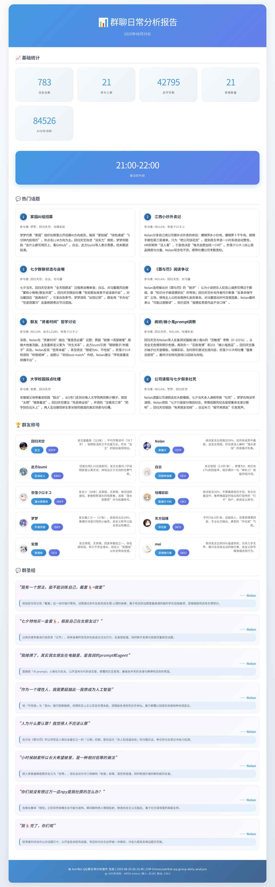

<div align="center">

# QQ群日常分析插件


[](https://github.com/SXP-Simon/astrbot-qq-group-daily-analysis)
[](https://github.com/AstrBotDevs/AstrBot)
[](LICENSE)

_✨ 一个基于AstrBot的智能群聊分析插件，能够生成精美的群聊日常分析报告。[灵感来源](https://github.com/LSTM-Kirigaya/openmcp-tutorial/tree/main/qq-group-summary)。 ✨_


    </div>


## 功能特色

### 🎯 智能分析
- **统计数据**: 全面的群聊活跃度和参与度统计
- **话题分析**: 使用LLM智能提取群聊中的热门话题和讨论要点
- **用户画像**: 基于聊天行为分析用户特征，分配个性化称号
- **圣经识别**: 自动筛选出群聊中的精彩发言

### 📊 可视化报告
- **多种格式**: 支持图片和文本输出格式
    - **精美图片**: 生成美观的可视化报告
    - **PDF报告**: 生成专业的PDF格式分析报告（需配置）
- **详细数据**: 包含消息统计、时间分布、关键词、金句等

### 🛠️ 灵活配置
- **群组管理**: 支持指定特定群组启用功能
- **参数调节**: 可自定义分析天数、消息数量等参数
- **定时任务**: 支持设置每日自动分析时间
- **自定义LLM服务** ：支持自定义指定的LLM服务

### 配置选项

| 配置项 | 说明 | 备注 |
|--------|------|--------|
| 启用自动分析 | 启用定时触发自动分析功能需要按照插件配置里面的说明填写相关的需要的字段；简略说明：打开自动分析功能，在群聊列表中添加群号或者使用 `/分析设置 enable` 启用当前群聊 | 默认关闭，需要填写机器人QQ号 |
| PDF格式的报告 | 初次使用需要使用 `/安装PDF` 命令安装依赖，首次使用命令安装，最后出现提示告诉你需要重启生效，是对的，需要重启 astrbot，而不是热重载插件。 | 输出格式需要设置为 PDF |
| 自定义LLM服务 | 通过配置文件设置自定义LLM服务的API Key、Base URL和模型名称，注意配置中的文字说明， Base URL 需要填写完整，例如 `https://openrouter.ai/api/v1/chat/completions` | 留空则使用 Astrbot 指定的当前提供商 |

上述配置情况仅供参考，注意仔细阅读插件配置页面中各个字段的说明，以插件配置中的说明为准

## 效果


## 使用方法

### 基础命令

#### 群分析
```
/群分析 [天数]
```
- 分析群聊近期活动
- 天数可选，默认为1天
- 例如：`/群分析 3` 分析最近3天的群聊

#### 分析设置
```
/分析设置 [操作]
```
- `enable`: 为当前群启用分析功能
- `disable`: 为当前群禁用分析功能  
- `status`: 查看当前群的启用状态
- 例如：`/分析设置 enable`


## 安装要求

### 基础要求
- 已配置LLM提供商（用于智能分析）
- QQ平台适配器


## 注意事项

1. **性能考虑**: 大量消息分析可能消耗较多LLM tokens
2. **数据准确性**: 分析结果基于可获取的群聊记录，可能不完全准确

## 更新日志

### v1.0.0
- 初始版本发布
- 支持基础群聊分析功能
- 智能话题和用户称号分析
- 精美可视化报告生成

### v1.1.0
- 修复了部分bug
- 优化了权限情况，管理员控制绝大部分命令（防止滥用 token）
- 增加了定时自动触发分析功能
- 发送 PDF 版的推送，提供命令安装相关配置，也可以不配置 PDF 版

### v1.2.0
- 增加了对 LLM 话题分析部分的提示词提示规范，并且提供正则处理来提高服务可用性

### v1.3.0
- token 消耗情况说明

### v1.4.0
- PDF 版本情况说明更新

### v1.7.0
- 修复提示
- 解耦化

### v1.8.0
- 修复表情统计情况

### v1.9.0
- 生成 24h 时间段活跃情况分析

### v2.1.0
- 支持配置自定义 Provider 或者留空，支持自定义模型的重试和超时处理，思考模型可以根据情况延长请求超时时间 

### v2.2.0
- image 格式的报告图片清晰度提高
- 字体稍微调大，但是实际效果也不怎么好，后续可能需要彻底改变排版方式再进行调整

### v2.3.0
- 修复定时触发自动分析无法获取到实例的 bug，现在启用该功能需要传入 bot 的 QQ 号

### v2.4.0
- 纠正无法正确获取当前使用的模型情况 

### v2.5.0
- 处理了自动分析器的不唯一问题
- 自动分析器并发处理群聊

### v2.6.0
- (自动分析处理) 纠正分析日期处理情况

### v2.7.0
- (llm_analyzer) LLM 输出 json 提取增强

### v2.8.0
- (#24) 在配置中启用 “偏好使用群昵称” @Ri-Nai

### v2.9.0
- PDF 安装过程不阻塞主线程

### v3.0.0
- 解决自动分析器获取群聊消息失败的问题

### v3.1.0
- llm_analyser 串行执行三部分分析导致处理单次请求耗时太长，修改为异步网络请求

### v3.2.0
- 自定义提示词模板，推荐根据群聊情况进行自定义修改以满足自己的需求

### v3.3.0
- 修复 `群分析获取历史消息的机制并不严格，出现超过当天消息、超过最大数量限制的情况` 的问题

### v3.4.0
- 自定义提示词模板，简单修复格式问题，尽量保证可用

## 许可证

MIT License

## 贡献

欢迎提交Issue和Pull Request来改进这个插件！
